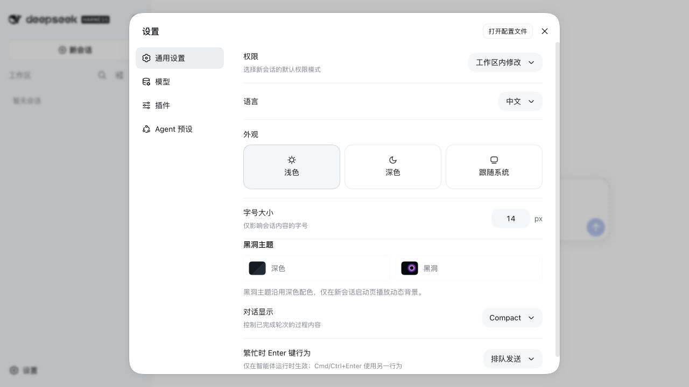

# 黑洞主题设置页审查

审查日期：2026-09-04  
范围：DSH「设置 → 通用设置 → 外观」以及黑洞主题下的深色一致性。

## 结论

原实现同时显示原生「外观」与插件「黑洞主题」两套选择器，且黑洞覆盖了全局暗色 token，造成状态权威和视觉语言不一致。修复后由一个四选一「外观」控件统一管理浅色、深色、黑洞、跟随系统；黑洞与原生深色的核心 UI token 完全一致，动态视觉只存在于新会话背景层。

## 步骤与健康度

1. **原设置页：有明显问题。** 两套主题选择器同时出现，原生浅色与插件深色可以呈现冲突选中态。

   

2. **统一外观入口：健康。** 插件通过官方 `appearance` Slot shadowing 提供浅色、深色、黑洞、跟随系统四个同级选项；黑洞紧跟深色。

   

3. **深色继承：健康。** 黑洞主题不再覆盖任何全局 UI token。相同视口下，原生深色与黑洞的设置面板、侧边栏、文字、边框和控件颜色一致，仅选中项与新会话背景不同。

   

4. **运行时：健康。** 真实 DSH 中黑洞背景为单实例、状态 `ready`、稳定约 60 FPS；侧边栏收起再展开只发生两次 settled resize，没有逐帧重建 GPU 目标。

## 可访问性

- 四项使用单个 `radiogroup` 与 `radio` 语义，选中态通过 `aria-checked` 暴露。
- 使用 roving `tabIndex`，并支持方向键在四项间循环选择与移动焦点。
- 本次验证覆盖浏览器可访问性树和键盘处理逻辑；未进行独立屏幕阅读器人工朗读测试。
