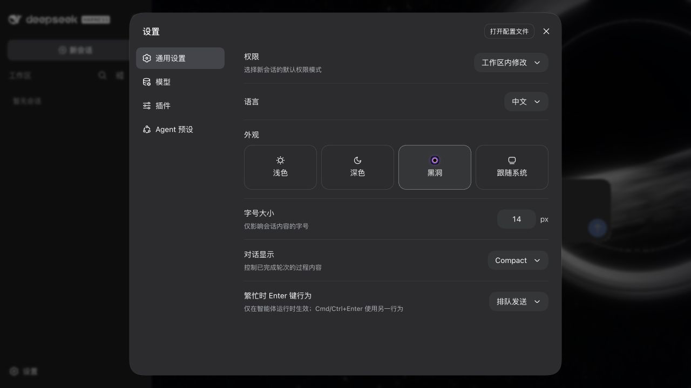
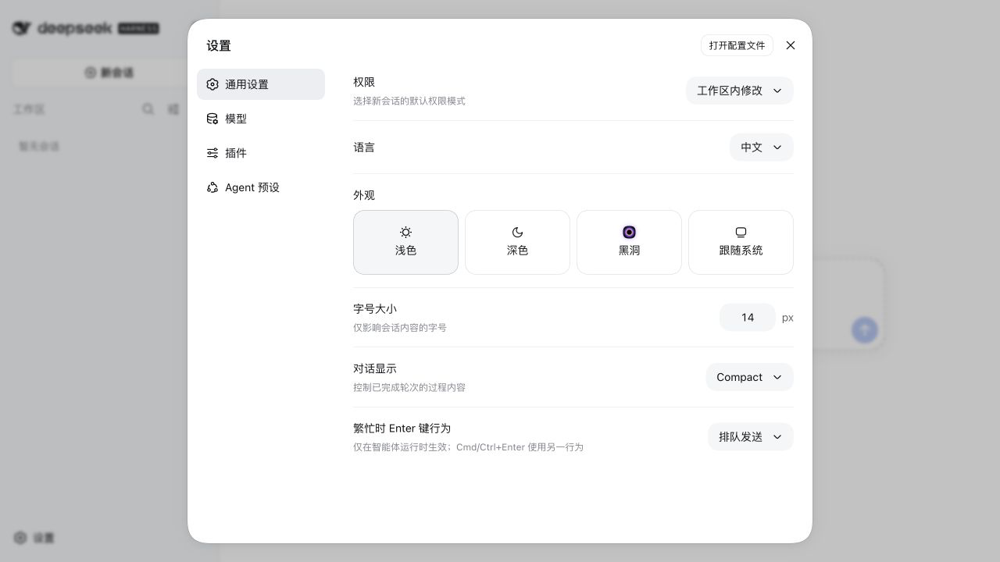
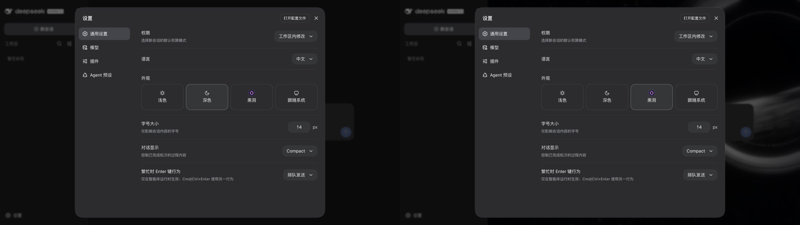

# DSH Black Hole Theme

为 DeepSeek Harness Web 注册可切换的黑洞主题，并把它接入原生「外观」选择器：

- **Black Hole**：完整沿用 DSH Dark 调色板，不覆盖设置页、侧边栏或通用控件 Token；只在新会话 Hero 中显示 WebGPU 黑洞背景。
- **Light / Dark / System**：仍由 DSH 内置主题系统处理和持久化。

黑洞动态层以 60 FPS 为目标，只在桌面宽屏、未启用“减少动态效果”且 WebGPU 可用时运行。其他环境只保留纯深色背景；离开新会话页或切换主题会释放 GPU 资源。

主题选择保存在 DSH Settings 的 `wxj-theme-black-hole` 命名空间中，可在页面重载后恢复。渲染层每秒更新一次 `data-fps` 与 `data-target-fps`，并通过 `data-target-resizes` 与 `data-target-size` 暴露中间纹理重建次数和尺寸，便于在真实页面检查动画是否维持目标帧率。

## 效果预览

### 黑洞主题与原生深色设置页



### 原生外观选择器集成



### DSH Dark 与黑洞主题配色对比



## 安装

直接安装 GitHub Release 中的预构建插件包：

```bash
pnpm dlx @deepseek-ai/dsh@0.1.2-rc.1 plugin --profile web add https://github.com/wxj783428795/dsh-plugins/releases/latest/download/dsh-theme-black-hole.tgz
pnpm dlx @deepseek-ai/dsh@0.1.2-rc.1 web
```

然后在“设置 → 通用设置 → 外观”中选择“黑洞”。

## 本地开发与安装

在本仓库根目录执行：

```bash
pnpm install
pnpm --filter @wxj783428795/dsh-theme-black-hole verify
pnpm dlx @deepseek-ai/dsh@0.1.2-rc.1 plugin --profile web add ./dsh-theme-black-hole
```

安装或更新插件后用 pnpm 启动 DSH Web：

```bash
pnpm dlx @deepseek-ai/dsh@0.1.2-rc.1 web
```

侧边栏收起/展开的性能回归可在已启用黑洞主题的 DSH Web 上验证：

```bash
DSH_PERF_URL='http://127.0.0.1:端口/?token=令牌' pnpm --filter @wxj783428795/dsh-theme-black-hole test:perf
```

该测试会确认侧边栏过渡期间最多只重建一次 WebGPU 中间纹理，且最终纹理尺寸与 0.7 DPR 的画布后备尺寸一致。

## 卸载

```bash
pnpm dlx @deepseek-ai/dsh@0.1.2-rc.1 plugin --profile web remove @wxj783428795/dsh-theme-black-hole
```

## 已知约束

当前 DSH 没有专门的新会话背景槽。插件只通过稳定的 `data-slot="conversation"` 和 `data-phase="hero"` 标记挂载装饰层，不读取 CSS Modules 的哈希类名；如果 DSH 后续提供正式 Hero 背景槽，应迁移到该槽位。
